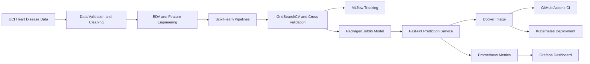

# Architecture

## Design decisions

- The preprocessing transformer and estimator are saved as one pipeline to prevent training-serving skew.
- Logistic Regression provides a transparent baseline; Random Forest represents a nonlinear ensemble.
- ROC-AUC is used as the tuning score because both ranking quality and class discrimination matter.
- The API exposes health, prediction, metrics, and OpenAPI documentation endpoints.
- Kubernetes probes and resource limits provide basic production-readiness controls.
